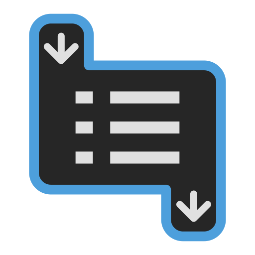

  

  <h1 align="center">Level-Design-Logic</h1>

Tools for setting up basic logic during Level Design. Allows for the set up and wiring of logic solely in the 3D Editor and Inspector. Outputs can be run once, multiple times, be delayed, wait for other outputs, check conditions, switch logic, etc.
